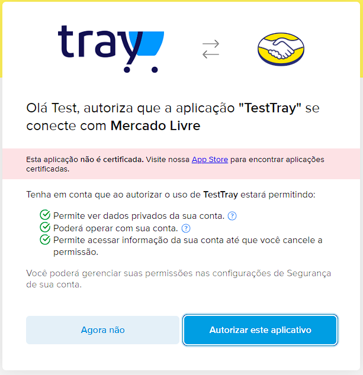
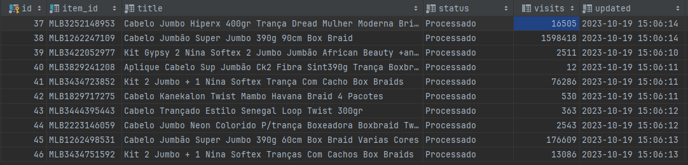

<p align="center"><a href="https://laravel.com" target="_blank"></a></p>

<p align="center">
<a href="https://packagist.org/packages/laravel/framework"></a>
</p>

# Test Tray - PHP Backend


## Considerações importantes

Na documentação disponibilizada pela equipe de devs da [Tray](https://tray.com.br/) é informado que ambos os endpoints,
tanto de `/sites` como de `/visits` não há a necessidade de autenticação com o Mercado Livre ou seja, são APIs publicas,
porém, o endpoint `/visits` quando consultado de forma publica, ou seja, sem passa o access_token **SEMPRE**
retorna `429(to_many_requests)` independentimente do tempo que o IP fica sem baser na API do Mercado Livre.

Ciente disso foi necessário criar(usuário de teste) e autenticar(app de teste) com o Mercado Livre a partir da
aplicação, apenas e exclusivamente para obter um token válido, e assim por fim ter acesso ao número de visitas do
anúncio.

Exclusivamente por esse motivo no arquivo `.env.example` e consequentimente `.env` existe a
key `MERCADOLIBRE_ACCESS_TOKEN` que é utilizado somente na API `/visits`.

Caso não tenha acesso a um access token válido é possível o app gerar um para você através do
endpoint ``/meli/authorization``, lembradno que é necessário preenchendo dados do APP:

```env
MERCADOLIBRE_CLIENT_ID=
MERCADOLIBRE_CLIENT_SECRET=
MERCADOLIBRE_REDIRECT_URI=https://127.0.0.1/meli/token
```



**Adendo**: A autenticação foi feita de forma crua(as pressas) utilizando o **Laravel Socialite** no
arquivo ``\App\Services\Meli\Resources\OAuth2``

**Obs**: Os tokens do Mercado Livre expiram de 6 horas após serem gerados, estou ciente que isso é uma má pratica(
armazenar token que expira no `.env`) e o correto seria ter um cron que fica renovando esse access token e atualizando o
token na coluna ``meli_users.access_token``

## Especificações

- PHP v8.2
- Laravel v10

### Packages

- Repository (SOSTheBlack/laravel-repository-pattern)
- Data Transfer Object - DTO (spatie/laravel-data)
- Laravel Socialite (socialiteproviders/mercadolibre)

## Instalação

Você pode instalar as dependências do aplicativo navegando até o diretório do aplicativo e executando o seguinte
comando.

Este comando usa um pequeno contêiner Docker contendo PHP e Composer para instalar as dependências da aplicação:

````shell
docker run --rm \
    -u "$(id -u):$(id -g)" \
    -v "$(pwd):/var/www/html" \
    -w /var/www/html \
    laravelsail/php82-composer:latest \
    composer install --ignore-platform-reqs
````

Obs: O docker deve estar ligado para rodar o comando acima, caso contrário dará erro de execução.

Crie um cópia do arquivo .env.example atravez do comando abaixo

````shell
cp .env.example .env
````

Com as depêndencias instaladas e o .env criado é hora de finalmente é hora de iniciar
o [laravel Sail](https://laravel.com/docs/10.x/sail)

````shell
./vendor/bin/sail up
````

No entanto, em vez de digitar repetidamente vendor/bin/sailpara executar comandos do Sail, você pode configurar um alias
de shell que permita executar os comandos do Sail com mais facilidade:

````shell
alias sail='[ -f sail ] && sh sail || sh vendor/bin/sail'
````

Para garantir que isso esteja sempre disponível, você pode adicioná-lo ao arquivo de configuração do shell em seu
diretório inicial, como `~/.zshrcou` e `~/.bashrc`, em seguida, reiniciar o shell.

Depois que o alias do shell tiver sido configurado, você poderá executar comandos Sail simplesmente digitando `sail`. O
restante dos comandos desta documentação assumirá que você configurou este alias.

## Usando

Foi desenvolvido um serviço que captura 10 anúncios do MercadoLivre e atualiza seus respectivos dados de visitas, e
disponibilize os dados dos anúncios em uma API REST em formato JSON.

A primeira etapa é buscarmos os 10 anúncio no Mercado Livre e salvar em nosso banco de dados como especificado no
discovery.
Iremos fazer isso através de um schedule que será executado de 10 em 10 minutos.

Para isso será necessário rodarmos o ``schedule:run`` comando Artisan que avaliará todas as suas tarefas agendadas e
determinará se elas precisam ser executadas com base no horário atual do servidor.

````shell
sail artisan schedule:run
````

Você terá um resultado semelhante a esse


O próximo passo é executar Job ``\App\Services\Meli\Jobs\SearchAndSaveItemsJob`` e resumidamente o seu trabalho consiste
em:

1. Consultar no banco de dados se existem 10 anúncios cadastrados.
2. Se não existir ou faltar anúncios, realizar a consulta na API de items do Mercado Livre
3. Inserir no banco de dados 10 anúncios capturados do Mercado Livre com status “Em processamento”.
4. Após a gravação dos dados, deve ser criado um evento na fila, para que seja
   realizado o processamento de atualização de visitas dos anúncios. Um de
   cada vez.

O job será excutado através da ``meli_get_items``, então vamos rodar a fila para executarmos o job

````shell
sail artisan queue:work --queue=meli_get_items
````


Agora já é possivel visualizar os anúncios recém cadastrados na tabela ``laravel.meli_items``


Muito bem. O próximo e último passo é atualizar as visitas que é feito através do
Job ``\App\Services\Meli\Jobs\GetAndSaveVisitsJob`` e resumidamente o seu trabalho consiste em:

1. Realize a consulta na API de /visits [2] do Mercado Livre.
2. Gravar no respectivo registro a quantidade de visitas.
3. Atualizar o status do anúncio no banco para “Processado”.
4. Atualize o campo updated com o timestamp atual.

O job será excutado através da ``meli_get_visits``, então vamos rodar a fila para executarmos o job

Lembre-se de ter um access token valido no .ENV ``MERCADOLIBRE_ACCESS_TOKEN``, caso contrário as visitas não serão
atualizadas

````shell
sail artisan queue:work --queue=meli_get_visits
````


Agora já é possivel visualizar o número de visitas tabela ``laravel.meli_items``


Pronto, agora o curl abaixo já possível visualizar através da API os anúncio e suas visitas

`````curl
curl --location '127.0.0.1/api/meli/items' \
--header 'Accept: application/json' \
--header 'Content-Type: application/json'
`````


### Considerações finais

Trabalhar na Tray e fazer parte da equipe de integrações é um objetivo que já tive a muitos anos prestes a se tornar realidade. Meu caminho de mais
de uma década como programador backend PHP foi marcado por desafios emocionantes e conquistas notáveis, especialmente na
área de integrações de marketplaces, ERPs e transportadoras.

Ao longo dos anos, adquiri um profundo entendimento das complexidades desses sistemas e suas necessidades de integração.
Essa experiência me permitiu desenvolver soluções eficazes que otimizam os processos, economizam tempo e recursos, e
aprimoram a experiência do cliente. Agora, estou ansioso para aplicar essa experiência na Tray.

Meu compromisso com a excelência na entrega de soluções tecnológicas e minha paixão por desvendar os intricados
quebra-cabeças das integrações me orientam em direção a uma carreira na qual posso fazer a diferença. Na Tray, vejo a
oportunidade de trabalhar em um ambiente de equipe colaborativa, abraçando a inovação e promovendo a evolução
tecnológica.

Agradeço sinceramente a oportunidade de fazer parte da equipe de integrações da Tray e estou pronto para contribuir para
o crescimento e o sucesso da empresa.
